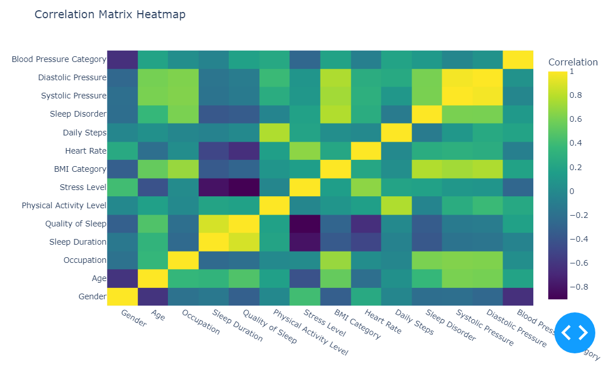

# SC1015 Mini Project
---
## About
This project features the data analysis of [Sleep Health and LifeStyle Dataset](https://www.kaggle.com/datasets/uom190346a/sleep-health-and-lifestyle-dataset/data) to make a model that can further prove the reliabilty and accuracy of the stronger predictors of sleep disorder that we analysed from the chosen dataset. The motive for this project is further substantiated by this [research paper](https://www.ncbi.nlm.nih.gov/pmc/articles/PMC8861160/) that shows the severity and significance of this issue as poor sleep is considered a national public health issue that needs to be looked into and by analysing these predictors, we are able to correctly identify and justify our recommendations on lifestyle changes for a better quality of sleep. 

---
## New Techniques Explored
- Plotly for heatmap visualisation
- Random forest method for machine learning model
- Gridsearch for further tuning of parameters
- Feature importance to analyse predictors

---
## Data Preparation and Cleaning 
We implemented the following steps to have a better dataset that can facilitate with a more accurate analysis in the later parts: 
1. Removing null values, duplicates and irrelevant columns like personID 
2. Cleaning categorical variables like merging similar catergories 
3. Standardised naming convention 
4. Removing poorly represented categories 
5. Split blood pressure column into systolic and diastolic blood pressure and then using it to categorise each individual's blood pressure category
Final Cleaned Dataframe:

---
## Exploratory Data Analysis
Using the cleaned dataframe, we made use of both univariate and bivariate analysis to show the patterns and relationship between predictors and sleep disorder. The insights gained from EDA were then used to pinpoint the top five  predictors for the machine learning models. We further narrowed it down to three using correlation matrix and using plotly for better visualisation. Based on our analysis and insights the top 3 predictors are:
1. Occupation 
2. Sleep duration
3. BMI Category 

---
# Machine Learning
After analysisng which predictors have stronger correlations based on EDA and feature importance of each predictor, 4 models were made using different combinations of the predictors: 
- Model 1. Occupation, Sleep Duration, BMI Category
- Model 2. BMI Category, Age, Daily Steps
- Model 3. Occupation, Sleep Duration, Daily Steps
- Model 4. BMI Category, Age, Gender

And for each model, we did the following : 
1. Create a model (depth=3,n_estimators=100) using RandomForest method first
2. We further tuned the parameters (max_depth and n_estimators) using GridSearch method      
3. We built a post-tuning model using RandomForest method 

RESULT : 

Model 3 is the best predictive model as it has the highest post-tuning test accuracy and the cross validation score of 0.9189 and 0.8991 which shows that our model's strong performance for reliable predictions in practical applications. 

Based on model 3,  the 3 best predictors for sleep disorders is sleep duration, daily steps and occupation which is a different combinations from EDA.

---
## Interesting Insights and Recommendations 
Though occupation is not something we would think of as reasons for sleep disorders are usually associated with biological and lifestyle choices, it still ended up as a strong predictor for sleep disorders highlighting the influence work has on our lives. Our recommendation is one can possibly prevent sleep disorders to improve quality of life through having longer hours of sleep and engaging in daily exercise. 

---
# Potential Issues When Viewing Notebook
1. Plotly heatmap may not show up when viewing - it can be viewed by rerunning the data preparation and calculating correlation (under choosing top 3 predictors section) parts of the notebook. Alternatively, a picture has been included for easier reference.

---
## Contributions
1. Jayashree Sivakumar (U2322599D) - Introduction, conclusion, results and recommendations
2. Faye Chan  (U2322426D )  - Data preparation and cleaning, EDA
3. Guan Xiaoxi (U2320285A) - Machine learning model
Rest was done together as a group :)

---
## References
1. Lee, Y. Y., Lau, J. H., Vaingankar, J. A., Sambasivam, R., Shafie, S., Chua, B. Y., Chow, W. L., Abdin, E., & Subramaniam, M. (2022, January 28). Sleep quality of singapore residents: Findings from the 2016 Singapore Mental Health Study. https://www.ncbi.nlm.nih.gov/pmc/articles/PMC8861160/
2. Tharmalingam, L. (2023, September 18). Sleep health and lifestyle dataset. Kaggle. https://www.kaggle.com/datasets/uom190346a/sleep-health-and-lifestyle-dataset/data 
3. Understanding-blood-pressure-readings. HealthHub. (2023, November 22). https://www.healthhub.sg/a-z/diseases-and-conditions/understanding-blood-pressure-readings 
